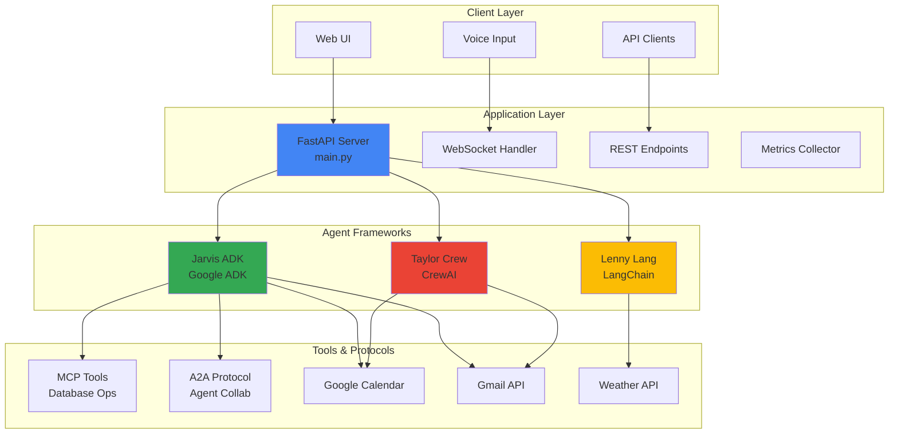
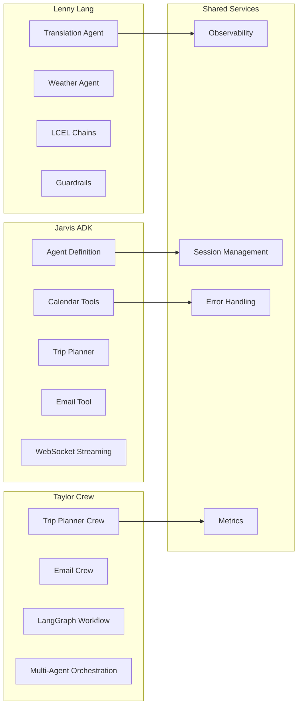

# Enterprise Gen AI Multi-Agent System 🤖

> **A production-ready multi-framework agent system integrating Google ADK, LangChain, and CrewAI for enterprise workflows**

[](https://www.python.org/downloads/)
[](https://github.com/google/adk)
[](https://python.langchain.com/)
[](https://docs.crewai.com/)

---

## 📋 Table of Contents

- [Problem Statement](#problem-statement)
- [Solution Overview](#solution-overview)
- [Architecture](#architecture)
- [Key Features](#key-features)
- [Framework Capabilities](#framework-capabilities)
- [Quick Start](#quick-start)
- [API Documentation](#api-documentation)
- [Deployment](#deployment)
- [Evaluation](#evaluation)
- [Project Journey](#project-journey)
- [Contributing](#contributing)

---

## 🎯 Problem Statement

Modern enterprises face three critical challenges in business automation:

### 1. **Fragmented Workflows**
- Calendar management scattered across tools
- Manual trip planning consuming hours
- Email responses requiring constant attention
- No unified interface for common tasks

### 2. **Limited AI Integration**
- Existing tools lack intelligent automation
- No natural language interfaces
- Missing multi-modal support (voice + text)
- Poor integration between systems

### 3. **Scalability Issues**
- Single-agent systems hit capability limits
- No collaboration between specialized agents
- Difficult to extend with new capabilities
- Hard to maintain and evolve

---

## 💡 Solution Overview

**Enterprise Gen AI Multi-Agent System** is a unified platform that brings together three powerful agent frameworks to solve real business problems:
- Stage 1: Calendar and email voice agent enabled.
- Calendar:
  
- app:
  
  
  
- app:
  
- app:
  
- app:
  
- phone_notification:
  


- Stage 2: Integrate Lagchain/Langgraph and crewai ecosystem(Future Work)
- 
- 
- 

- Stage 3: Unified business app for employee travel plan arrangement with budget detection to provide the best experience for the group for the shared budget money contribution, meeting scheduler, email chat agent, Email response automation for recent important emails, LinkedIn_post_generator. (Future Work)

### The Vision
Create an intelligent assistant ecosystem where specialized agents collaborate to automate complex workflows, from calendar management to trip planning to email automation.

### The Approach
- **Multi-Framework Integration**: Leverage the strengths of ADK, LangChain, and CrewAI
- **Unified API**: Single FastAPI application exposing all capabilities
- **Agent Collaboration**: Agents work together via A2A protocol
- **Production-Ready**: Observability, metrics, error handling, deployment-ready

### Value Proposition
- ⏱️ **Save Time**: Automate routine tasks (calendar, email, planning)
- 🎯 **Increase Accuracy**: AI-powered decision making
- 🔄 **Seamless Integration**: All tools in one place
- 📈 **Scalable**: Add new agents and capabilities easily
- 🗣️ **Natural Interaction**: Voice and text interfaces

---

## 🏗️ Architecture

### High-Level Architecture



### Component Architecture



---

## ✨ Key Features

### 🤖 Multi-Agent System

#### Parallel Agents
- **Lenny Lang**: Multiple agents (translation + weather) running independently
- **Taylor Crew**: Specialized agents (city selector, local expert, concierge)

#### Sequential Agents
- **Trip Planning**: City selection → Information gathering → Itinerary creation
- **Email Processing**: Check emails → Analyze → Create drafts → Save

#### Loop Agents
- **LinkedIn Post Generator**: Iterative content improvement (in jarvis_adk)
- **Persistent Storage**: Continuous state management

### 🛠️ Comprehensive Tools

#### MCP (Model Context Protocol)
- **Local MCP Server**: SQLite database operations
- **Remote MCP Agent**: External server connections
- **Tool Filtering**: Selective tool loading for security

#### Custom Tools
- **Calendar Operations**: CRUD for Google Calendar events
- **Trip Planning**: Multi-agent travel itinerary generation
- **Email Sending**: Gmail integration
- **Weather Fetching**: Real-time weather data

#### Built-in Tools
- **Google Search**: Web search capabilities (via Serper)
- **Code Execution**: Calculator and computation tools
- **Web Scraping**: Browserless integration

#### OpenAPI Tools
- **Weather API**: OpenWeatherMap integration
- **Gmail API**: Email operations
- **Calendar API**: Google Calendar integration

### 💾 Sessions & Memory

#### Session Management
- **InMemorySessionService**: Fast in-memory session storage
- **User Sessions**: Per-user conversation history
- **Session IDs**: Unique identifier for each interaction

#### State Management
- **LangGraph State**: Structured state for workflows
- **Conversation History**: Full context preservation
- **Cross-Agent State**: Shared state between agents

#### Memory Bank
- **Persistent Storage**: Long-term memory (jarvis_adk/persistent-storage)
- **Context Compaction**: Efficient context management
- **Retrieval**: Smart context retrieval

### 📊 Observability

#### Logging
- **Structured Logging**: JSON-formatted logs
- **Log Levels**: DEBUG, INFO, WARNING, ERROR
- **Context**: Request IDs, session IDs, timestamps

#### Tracing
- **Request Tracing**: End-to-end request tracking
- **Agent Tracing**: Tool invocations and decisions
- **Performance Tracking**: Latency measurements

#### Metrics
- **Request Metrics**: Total requests, requests per endpoint
- **Error Metrics**: Error count, error rate
- **Session Metrics**: Active sessions, session duration
- **Performance Metrics**: Response times, throughput

### 🔄 A2A Protocol

#### Agent-to-Agent Communication
- **Simple A2A**: Basic peer-to-peer communication
- **Friend Scheduling**: Multi-agent meeting coordination
- **LangGraph Integration**: Kaitlynn agent with state management

#### Collaboration Patterns
- **Request-Response**: Direct agent queries
- **Publish-Subscribe**: Event broadcasting
- **Orchestration**: Coordinated multi-agent workflows

### 🚀 Agent Deployment

#### Deployment Options
- **Local Development**: `uvicorn main:app --reload`
- **Docker**: Containerized deployment (Dockerfile included)
- **Cloud Run**: Google Cloud Run deployment
- **Agent Engine**: Google Agent Engine deployment

---

## 🎨 Framework Capabilities

### 1. Jarvis ADK (Google ADK Framework)

**Location**: [`app/jarvis_adk/`](app/jarvis_adk/)

#### Overview
Voice-enabled AI assistant powered by Gemini 2.0 Flash Experimental with real-time streaming capabilities.

#### Capabilities
- 📅 **Calendar Management**: List, create, edit, delete events
- ✈️ **Trip Planning**: AI-powered travel itinerary generation
- 📧 **Email Operations**: Send emails via Gmail
- 🎙️ **Voice Interaction**: Native audio processing
- 🔄 **Real-time Streaming**: WebSocket-based instant responses

#### Tools
- `list_events`: Retrieve calendar events
- `create_event`: Add new calendar events
- `edit_event`: Modify existing events
- `delete_event`: Remove events
- `plan_trip`: Generate trip itineraries
- `send_email`: Send emails

#### Key Technologies
- Google ADK
- Gemini 2.0 Flash Experimental
- FastAPI + WebSockets
- Google Calendar API
- OAuth 2.0

#### Documentation
See [Jarvis ADK README](app/jarvis_adk/README.md) for detailed documentation.

---

### 2. Lenny Lang (LangChain Framework)

**Location**: [`app/lenny_lang/`](app/lenny_lang/)

#### Overview
Intelligent agents built with LangChain showcasing LCEL (LangChain Expression Language) patterns and tool calling.

#### Capabilities
- 🌐 **Language Translation**: Multi-language translation with 4 LCEL patterns
- 🌤️ **Weather Information**: Real-time weather with intelligent guardrails
- 🔗 **LCEL Patterns**: Message chains, parsers, templates
- 🛡️ **Guardrails**: Query validation and filtering

#### Agents

**Language Translation Agent**
- 4 different LCEL implementation patterns
- Groq API with Gemma2-9b-it model
- Streamlit UI
- Multi-language support

**Weather Agent**
- Tool calling with OpenWeatherMap
- Guardrail system for query validation
- Qwen3-32b model (optimized for tools)
- Streamlit UI

#### Key Technologies
- LangChain
- LangChain LCEL
- Groq API
- OpenWeatherMap API
- Streamlit

#### Documentation
See [Lenny Lang README](app/lenny_lang/README.md) for detailed documentation.

---

### 3. Taylor Crew (CrewAI Framework)

**Location**: [`app/taylor_crew/`](app/taylor_crew/)

#### Overview
Multi-agent orchestration system using CrewAI for complex collaborative tasks.

#### Capabilities
- ✈️ **Trip Planning**: Multi-agent travel planning system
- 📧 **Email Automation**: Automated email processing with LangGraph
- 🤝 **Agent Collaboration**: Coordinated multi-agent workflows
- 📊 **LangGraph Integration**: State management and workflows

#### Crews

**Trip Planner Crew**
- **City Selector Agent**: Analyzes and selects best destination
- **Local Expert Agent**: Gathers city information and attractions
- **Travel Concierge Agent**: Creates detailed itinerary with budget

**Email Crew**
- **LangGraph Workflow**: Check → Analyze → Draft → Save
- **Gmail Integration**: Automated email processing
- **State Management**: Structured workflow state

#### Key Technologies
- CrewAI
- LangGraph
- Gmail API
- Serper API (search)
- Browserless (web scraping)

#### Documentation
See [Taylor Crew README](app/taylor_crew/README.md) for detailed documentation.

---

### 4. MCP Tools (Model Context Protocol)

**Location**: [`app/mcp/`](app/mcp/)

#### Overview
Standardized protocol for connecting AI agents to external tools and data sources.

#### Capabilities
- 🗄️ **Database Operations**: SQLite CRUD operations
- 🔌 **Local MCP Server**: Process-based tool servers
- 🌐 **Remote MCP Agent**: HTTP-based server connections
- 🔒 **Tool Filtering**: Security through selective tool exposure

#### Tools
- `list_tables`: List database tables
- `describe_table`: Get table schema
- `query`: Execute SELECT queries
- `insert`: Add records
- `update`: Modify records
- `delete`: Remove records

#### Documentation
See [MCP README](app/mcp/README.md) for detailed documentation.

---

### 5. A2A Protocol (Agent-to-Agent Communication)

**Location**: [`app/a2a_protocol/`](app/a2a_protocol/)

#### Overview
Protocol for enabling autonomous agents to communicate and collaborate.

#### Capabilities
- 🤝 **Peer-to-Peer Communication**: Direct agent messaging
- 📅 **Multi-Agent Scheduling**: Friend scheduling system
- 🔄 **Distributed Workflows**: Coordinated task execution
- 📊 **LangGraph Integration**: Kaitlynn agent with state management

#### Implementations
- **Simple A2A**: Basic agent communication
- **Friend Scheduling**: Multi-agent meeting coordination
- **Kaitlynn Agent**: LangGraph-based A2A agent

#### Documentation
See [A2A Protocol README](app/a2a_protocol/README.md) for detailed documentation.

---

## 🚀 Quick Start

### Prerequisites

- **Python 3.10+**
- **Google Cloud Account** (for Calendar and Gmail APIs)
- **API Keys**:
  - Gemini API key
  - Groq API key (for Lenny Lang)
  - OpenWeatherMap API key (for weather)
  - Serper API key (for search)
  - Browserless API key (for web scraping)

### Installation

1. **Clone the repository**:
```bash
git clone <repository-url>
cd capstone_project
```

2. **Create virtual environment**:
```bash
python -m venv .venv

# Windows
.venv\Scripts\activate

# macOS/Linux
source .venv/bin/activate
```

3. **Install dependencies**:
```bash
pip install -r requirements.txt
```

4. **Set up environment variables**:

Create `.env` file in the root directory:
```env
# Gemini API (required)
GOOGLE_API_KEY=your_gemini_api_key

# Groq API (for Lenny Lang)
GROQ_API_KEY=your_groq_api_key

# OpenWeatherMap (for weather agent)
OPENWEATHERMAP_API_KEY=your_openweathermap_key

# Serper API (for search)
SERPER_API_KEY=your_serper_key

# Browserless (for web scraping)
BROWSERLESS_API_KEY=your_browserless_key

# OpenAI (optional, for CrewAI)
OPENAI_API_KEY=your_openai_key
```

> ⚠️ **IMPORTANT**: Never commit API keys to version control. The `.env` file is in `.gitignore`.

5. **Set up Google Calendar** (for Jarvis ADK):
```bash
python setup_calendar_auth.py
```

This will:
- Open browser for OAuth authorization
- Save credentials securely
- Test calendar connection

6. **Run the application**:
```bash
uvicorn main:app --reload
```

The application will start at `http://localhost:8000`

### Quick Test

1. **Open browser**: Navigate to `http://localhost:8000`
2. **API Documentation**: Visit `http://localhost:8000/docs`
3. **Health Check**: `curl http://localhost:8000/health`
4. **Metrics**: `curl http://localhost:8000/metrics`

---

## 📚 API Documentation

### REST Endpoints

#### Application Info
```http
GET /api/info
```
Returns application information and available agents.

#### Health Check
```http
GET /health
```
Returns application health status.

#### Metrics
```http
GET /metrics
```
Returns observability metrics.

---

### Jarvis ADK Endpoints

#### WebSocket Streaming
```http
WS /ws/{session_id}?is_audio=true|false
```
Real-time agent interaction with voice or text.

**Example (JavaScript)**:
```javascript
const ws = new WebSocket('ws://localhost:8000/ws/user123?is_audio=false');

ws.onopen = () => {
    ws.send(JSON.stringify({
        mime_type: "text/plain",
        data: "What's on my calendar today?",
        role: "user"
    }));
};

ws.onmessage = (event) => {
    const message = JSON.parse(event.data);
    console.log(message.data);
};
```

---

### Lenny Lang Endpoints

#### Translation
```http
POST /api/lenny/translate
Content-Type: application/json

{
    "text": "Hello, how are you?",
    "target_language": "French",
    "choice": 4
}
```

**Response**:
```json
{
    "status": "success",
    "original_text": "Hello, how are you?",
    "target_language": "French",
    "translated_text": "Bonjour, comment allez-vous?",
    "method": "LCEL Pattern 4"
}
```

#### Weather
```http
POST /api/lenny/weather
Content-Type: application/json

{
    "query": "What's the weather in London?"
}
```

**Response**:
```json
{
    "status": "success",
    "query": "What's the weather in London?",
    "response": "The current temperature in London is 15°C with partly cloudy skies..."
}
```

---

### Taylor Crew Endpoints

#### Trip Planning
```http
POST /api/taylor/plan-trip
Content-Type: application/json

{
    "origin": "San Francisco",
    "cities": "Paris, Rome, Barcelona",
    "date_range": "June 15-25, 2024",
    "interests": "Art, food, history"
}
```

**Response**:
```json
{
    "status": "success",
    "trip_plan": "Detailed itinerary with daily activities, budget, and recommendations..."
}
```

#### Email Processing
```http
POST /api/taylor/process-emails
```

**Response**:
```json
{
    "status": "success",
    "message": "Email processing completed",
    "result": "Processed 5 emails, created 3 drafts"
}
```

---

## 🚀 Deployment

### Local Development

```bash
uvicorn main:app --reload --host 0.0.0.0 --port 8000
```

### Docker Deployment

**Create `Dockerfile`**:
```dockerfile
FROM python:3.10-slim

WORKDIR /app

COPY requirements.txt .
RUN pip install --no-cache-dir -r requirements.txt

COPY . .

EXPOSE 8000

CMD ["uvicorn", "main:app", "--host", "0.0.0.0", "--port", "8000"]
```

**Build and run**:
```bash
docker build -t enterprise-agents .
docker run -p 8000:8000 --env-file .env enterprise-agents
```

### Google Cloud Run

1. **Create `cloudbuild.yaml`**:
```yaml
steps:
  - name: 'gcr.io/cloud-builders/docker'
    args: ['build', '-t', 'gcr.io/$PROJECT_ID/enterprise-agents', '.']
  - name: 'gcr.io/cloud-builders/docker'
    args: ['push', 'gcr.io/$PROJECT_ID/enterprise-agents']
  - name: 'gcr.io/cloud-builders/gcloud'
    args:
      - 'run'
      - 'deploy'
      - 'enterprise-agents'
      - '--image=gcr.io/$PROJECT_ID/enterprise-agents'
      - '--platform=managed'
      - '--region=us-central1'
      - '--allow-unauthenticated'
```

2. **Deploy**:
```bash
gcloud builds submit --config cloudbuild.yaml
```

### Environment Variables in Production

Use secret management:
```bash
# Google Cloud Secret Manager
gcloud secrets create gemini-api-key --data-file=- < api_key.txt

# Reference in Cloud Run
gcloud run services update enterprise-agents \
  --update-secrets=GOOGLE_API_KEY=gemini-api-key:latest
```

---

## 📊 Evaluation

### Agent Performance Metrics

#### Response Quality
- **Accuracy**: Correct tool selection and execution
- **Relevance**: Responses match user intent
- **Completeness**: All required information provided

#### Task Completion
- **Success Rate**: % of tasks completed successfully
- **Failure Analysis**: Categorization of failures
- **Retry Success**: Recovery from transient errors

#### Performance
- **Latency**: Time to first response
- **Throughput**: Requests per second
- **Resource Usage**: CPU, memory, API calls

### Evaluation Strategy

1. **Unit Tests**: Individual agent and tool testing
2. **Integration Tests**: End-to-end workflow testing
3. **Load Tests**: Performance under high load
4. **User Testing**: Real-world usage scenarios
5. **A/B Testing**: Compare different approaches

### Metrics Dashboard

Access at `/metrics`:
```json
{
    "uptime_seconds": 3600,
    "requests_total": 1250,
    "requests_by_endpoint": {
        "/api/lenny/translate": 450,
        "/api/taylor/plan-trip": 200,
        "/ws/{session_id}": 600
    },
    "errors_total": 15,
    "active_sessions": 12,
    "error_rate": 0.012
}
```

---

## 🎓 Project Journey

### Problem Discovery
Identified three key pain points in enterprise workflows:
1. Fragmented calendar and scheduling tools
2. Manual trip planning consuming significant time
3. Email overload requiring constant attention

### Solution Design
Decided to build a multi-framework system to leverage:
- **ADK**: Real-time voice interaction and streaming
- **LangChain**: Flexible chain composition and tool calling
- **CrewAI**: Multi-agent orchestration for complex tasks

### Technical Challenges

#### Challenge 1: Framework Integration
**Problem**: Three different frameworks with different APIs
**Solution**: Unified FastAPI layer with consistent REST endpoints

#### Challenge 2: Session Management
**Problem**: Maintaining state across multiple agents
**Solution**: InMemorySessionService with session IDs

#### Challenge 3: Real-time Streaming
**Problem**: WebSocket complexity with audio/text
**Solution**: Bidirectional messaging with proper error handling

#### Challenge 4: Observability
**Problem**: Debugging distributed agent systems
**Solution**: Structured logging, metrics collection, tracing

### Key Learnings

1. **Multi-framework benefits**: Each framework excels at different tasks
2. **Agent collaboration**: A2A protocol enables powerful workflows
3. **Observability is critical**: Essential for production systems
4. **API design matters**: Consistent APIs improve developer experience
5. **Documentation is key**: Comprehensive docs enable adoption

### Innovation Highlights

- **Unified Interface**: Single API for three frameworks
- **Voice + Text**: Multi-modal interaction
- **Agent Collaboration**: A2A protocol integration
- **Production-Ready**: Observability, metrics, error handling
- **Extensible**: Easy to add new agents and capabilities

---

## 🤝 Contributing

We welcome contributions! Please see our contributing guidelines.

### Development Setup

1. Fork the repository
2. Create a feature branch
3. Make your changes
4. Add tests
5. Submit a pull request

### Code Style

- Follow PEP 8
- Use type hints
- Add docstrings
- Write tests

---

## 📄 License

This project is released under the MIT License.

---

## 🙏 Acknowledgments

- **Google ADK Team**: For the amazing ADK framework
- **LangChain Team**: For the powerful LangChain library
- **CrewAI Team**: For the innovative multi-agent framework
- **Community**: For feedback and contributions

---

## 📞 Support

- **Documentation**: See framework-specific READMEs
- **Issues**: Open an issue on GitHub
- **Discussions**: Join our community discussions

---

**Built with ❤️ by the Enterprise Agents Team**
